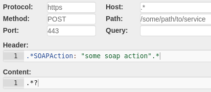
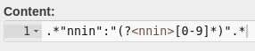
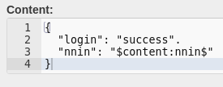

# Troxy

Troxy is an highly configurable and extendable application that simulates responses using the HTTP(S) protocol. Troxy can handle many simultaneous requests making it an excellent choice to use when running performance tests against your application.

## Build
Build Troxy
`mvn clean install`

###### Build docker image
`docker build -t troxy .` 

###### Start docker container on port 8080
`docker run -p 8080:8080 troxy` 

###### Running Troxy from code
Troxy can be started locally by running Troxy.main(). The working directory must be set to troxy/local

## Request Matching

Troxy can match requests based on different attributes in the HTTP protocol. 
* Protocol
* HTTP Method
* Port
* Host
* Path
* Query parameters
* Header
* Content 
    
All of these attributes use regular expressions.

## Modes

Troxy can be run in different modes.

##### Forwarding

In this mode, troxy will forward requests to the specified backend system and responses are then forwarded back to the client. 

##### Recording

In this mode, troxy will forward requests to the backend system and make a mock-recording of the responses before forwarding them back to the client. The recordings are then saved on a file and can be viewed under the "Opptak" tab.  

##### Playback

In this mode, troxy matches incoming requests with existing mocks. If a match is found, the matching response is sent back. If no match is found, Troxy will return HTTP status 418.

##### Record or Playback

In this mode, Troxy will send back a matching response if found. If a response is not found the request will be forwarded to the backend system and a new recording will be created.

##### Forwarding or Playback

In this mode, Troxy will send back a matching response if found. If a response is not found the request will be forwarded to the backend system but Troxy will not record the response. This mode is designed to be used for manual testing when you want to mock a set of requests, while sending other requests as usual to the backend system. 

## API
Troxy provides an API where you can change the mode or upload mocks from disk

##### Upload mocks
~~~~
curl -v -F directory="troxyfolder/" -F file="@recordings-201909171032.zip" http://localhost:8080/api/upload
curl -v -F directory="troxyfolder/" -F file="@single_recording.troxy" http://localhost:8080/api/upload
~~~~

##### Change mode
~~~~
Troxy modes
PLAYBACK
RECORD
PLAYBACK_OR_RECORD
PASSTHROUGH
PLAYBACK_OR_PASSTHROUGH

curl 'http://localhost:8080/api/status/mode' -X PUT --data 'RECORD'
~~~~

##### Statistics interval
~~~~
Statistics interval (minutes)
0
1
5
10
15
30
60
1440

curl 'http://localhost:8080/api/status/statisticsInterval' -X PUT --data '5'
~~~~

## Editing recordings

Recordings are saved as files with a .troxy file extension. All recordings are available for editing in the GUI under the "Opptak" tab. Individual recordings can also be activated or disabled under this tab.

### Time delay
Mocks can be configured using different time delay strategies. 

**None** - The response is returned directly with no delay

**Permanent** - The response is returned after a configured value is reached

**Random** - The response is returned after a random time, between the limits that are configured, is reached

**Normally distributed** - The response time is calculated by a normally distributed curved where min and max values are configured.

**Exponential distribution** - The response time is calculated using an exponential distribution where min, average and max values are configured.

### Regex-matching

All HTTP attributes use regular expressions. 

Below is an example illustrating how this works. The header must contain a specific SOAPAction but anything else in the same header field uses regular expressions.

**Tip:** you can press Ctrl + Space to get a small list of commonly used regular expressions.

#### Group capturing
You can use regular expression group capturing to extract values from the request and insert those in the response. 

##### Example
In this example a social security number is extracted from a request body by using the following group capturing syntax: `(?<nnin>[0-9]*)`. The result (the social security number) is extracted to a group named nnin.

The extracted value can then be used in the response by the following syntax: `$content:nnin$` 
Note that you need to specify where the value was extracted from (in this case content). If the value was extracted from the header the syntax would be `$header:nnin$`. To get a list of defined regular expression groups in the Response tab, you can again use Ctrl + Space to get a list.

#### Environment variables in mock response
You can fetch environment variables and insert those in the response to provide a more dynamic mock. Syntax is `$env:MYENVIRONMENTVARIABLE$`

### Sequence
Troxy can use the same request for several different responses. There are two strategies used when this mode is enabled for a recording.

**Random** - When an expected incoming request is made, one of the available responses are chosen at random. It is possible to weigh responses. For example, one response can have a 25% chance to be returned, and another can have a 75% chance.

**Sequential** - When an expected incoming request is made, the responses are returned sequentially. If a recording has several responses; the first response will be returned for the first request, the second response for the second request and so on. When the last response is reached, response 1 will be returned next. In this mode we also have the option of weighing responses so that one response can be returned several times before continuing to the next one. 

## Logging

The logging tab shows the content from the log file `simulator.log`. 

## Application configuration

In order to get your application to send its traffic through Troxy you have to add the Troxy URL before the backend request url.

~~~~
# Example
# Original setting
some_rest_api_url=https://some-api.sparebank1.no

# Through Troxy
some_rest_api_url=https://troxy.test.sparebank1.no/https://some-api.sparebank1.no
~~~~

If you use docker you can link to it instead in the compose file

~~~~
yourapplication:
  image: __IMAGE_REPO_AND_TAG__
  links:
  - troxy:some-api.sparebank1.no
~~~~

## Filters

Filters are a way to extend the functionality of Troxy. Filters have access to modify requests and their respective responses during both recording and playback. Compiled filters (.jar) must be moved to the `/opt/troxy/data/filters` folder in order to be picked up by Troxy.

#### Filter phases
A filter can manipulate a request and response in the following five phases in this specific order:

1. Upon receiving a client request, before Troxy searches for matching recordings.
2. Before a request is forwarded to the backend system
3. When receiving a response from the backend system
4. When creating a new recording (does not apply to recordings created through the user interface).
5. Before responses are sent to the client.

**Note:** If you do not communicate with a backend system (i.e mode Playback), phases 2, 3 and 4 will not be activated.

#### Filter configuration
Filters can be configured under the "Oppsett" tab. 

A filter will not run unless it is first activated

`filter.<filtername>.enabled=true`

Implemented filters might have their own configuration. This configuration can be accessed as shown below

`filter.<filtername>.config.<key>=<value>`

#### Filters included by default
There are some filters that are included in Troxy by default. Examples of these can be found in the Troxy configuration file `troxy.properties`

**AutoRegexNewRecording**
A filter that searches for text in new recordings that matches the specified configured regular expression,
It then replaces the text with the configured regular expression or specified value.

**DelayResponse**
A filter that handles time delays for recordings

**KeyBasedReplace**
A filter that searches for a key in the request. If the key is found it will use the key to pick a value from a data file and use this value in the response.

**SetRecordingDelay**
A filter that will set time delays on new recording based on the real time it took during the record. 

**FunctionReplace**
A filter that replaces keys with a support function. Keys are replaced in both the response body and header in the recorded Troxy response. More supported functions may be added at a later time.
One of the functions supported are `now`. now replaces a specified key with a timestamp on a specified format.

## Statistics
Under the "Statistikk" tab you can see statistics of the number of requests for different recordings. The interval is default set to 60 minutes but can be configured in the file troxy.properties or under the Status page.

